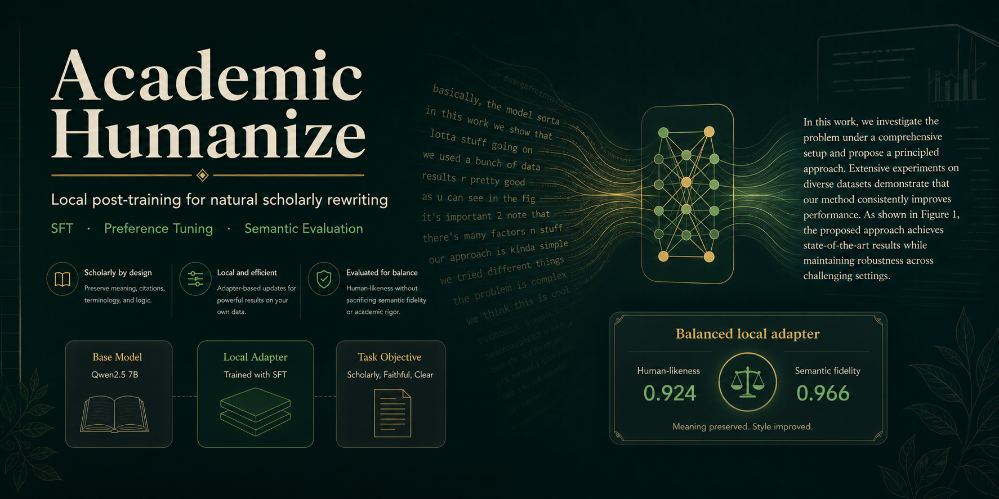
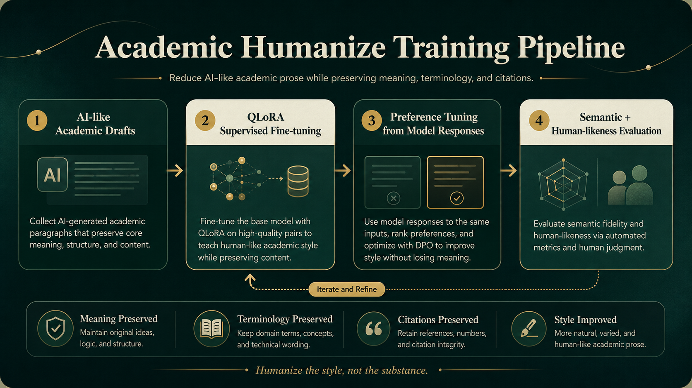
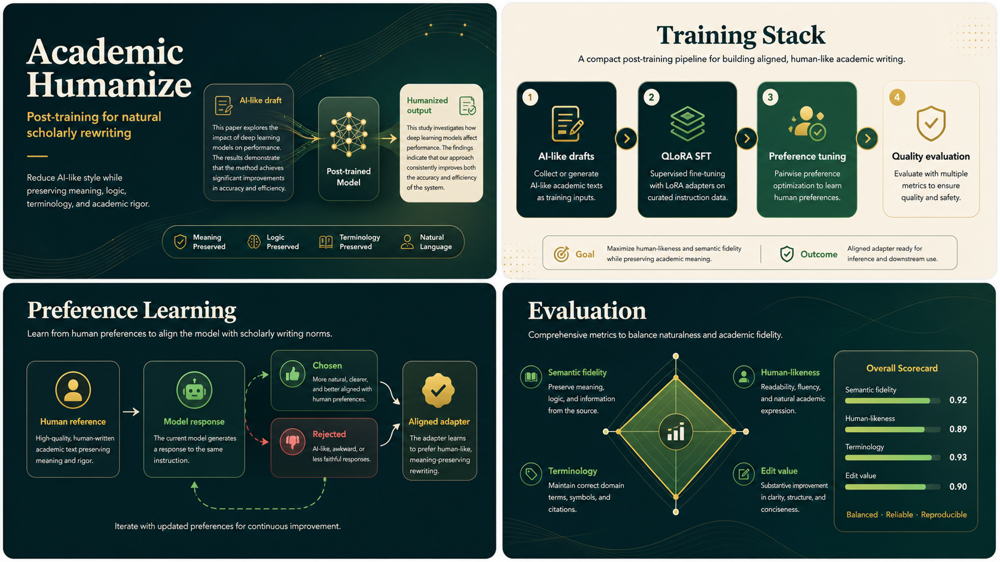

<p align="center">
  
</p>

<p align="center">
  <a href="README.md">中文</a> · <a href="https://huggingface.co/XiaoXu123123/academic-humanize-qwen25-7b-dpo-v2-lora">Hugging Face Adapter</a> · <a href="#technical-pipeline">Technical Pipeline</a> · <a href="#results">Results</a> · <a href="#quick-start">Quick Start</a> · <a href="#reproduce-the-pipeline">Reproduce</a>
</p>

<p align="center">
  
  
  
  
  
</p>

# Academic Humanize

Academic Humanize is a post-training project for academic English rewriting. Its goal is to turn "AI-style reduction" into a trainable, optimizable, and measurable engineering pipeline.

The project covers paper PDF/Markdown preparation, paragraph extraction, quality filtering, AI-like draft construction, QLoRA SFT, SPIN-style DPO, iterative DPO, automatic metrics, and LLM-as-Judge evaluation.

```text
Input      : an over-polished, formulaic, AI-like academic paragraph
Output     : a more natural scholarly rewrite
Hard rules : preserve meaning, numbers, citations, terminology, conclusions, and logic
```

<p align="center">
  
</p>

## Project Highlights

- **Local 7B post-training loop**: QLoRA SFT, SPIN-style DPO, and iterative DPO on Qwen2.5-7B-Instruct, with API baselines for comparison.
- **Sharper task definition**: academic AI-style reduction is decomposed into AI-like draft construction, semantic fidelity, terminology preservation, naturalness, and edit value.
- **Low-cost preference data**: current model outputs become rejected responses, while human references become chosen responses.
- **Two-layer evaluation**: BERTScore-F1, chrF++, BLEU, TER, format diagnostics, a six-dimensional LLM-as-Judge rubric, and a finer Binary24 judge.
- **Comparable baselines**: SFT, DPO-v1, DPO-v2, and multiple API models are evaluated under the same pipeline.
- **Released model weights**: the DPO-v2 LoRA adapter is available on [Hugging Face](https://huggingface.co/XiaoXu123123/academic-humanize-qwen25-7b-dpo-v2-lora) and can be loaded with `Qwen/Qwen2.5-7B-Instruct`.

## My Contributions

- I designed the paragraph-level Academic Humanize data format: `instruction + AI-like input -> human reference output`.
- I implemented QLoRA SFT training, LoRA prediction, API baseline prediction, resume support, and concurrent API calls.
- I built the SPIN-style DPO pair construction flow and completed the DPO-v1 and iterative DPO-v2 training loop.
- I built the automatic metrics and LLM-as-Judge evaluation stack with fixed prompts and schemas for both 6D and Binary24 rubrics.
- I packaged the open-source version with toy examples, configs, training scripts, evaluation scripts, and README visuals.

## Why this project

General-purpose LLMs can make academic text more fluent, but they often introduce three problems:

- More AI-like wording: frequent use of words such as `pivotal`, `underscore`, and formulaic paired clauses.
- Unstable semantics: claims, numeric details, terminology, citations, or logical strength may change during polishing.
- Weak evaluation signals: BLEU, chrF, and BERTScore measure reference similarity, but they do not directly answer whether the rewrite reads like human scholarly English.

This project focuses on a narrower and harder problem: reducing AI writing traces while keeping academic meaning safe.

## What you get

- A reproducible post-training pipeline for academic text humanization.
- A lightweight RLHF / preference optimization example from SFT to DPO and iterative DPO.
- A reusable evaluation stack: automatic metrics for semantic fidelity and LLM-as-Judge for naturalness, terminology, and edit value.
- API baseline comparisons for understanding the gap between local 7B LoRA adapters and proprietary models.
- A transferable data construction recipe: if you have AI-like inputs and human references, the pipeline can be adapted to other academic-writing scenarios.

<p align="center">
  
</p>

## Technical Pipeline

The core contribution is to decompose academic AI-style reduction into five operational stages: corpus preparation, data construction, SFT, DPO, and evaluation.

### 1. Corpus preparation: from PDF to paragraph inventory

The data pipeline starts from real academic papers, mainly collected from journals in management and information systems (IS). I convert the paper PDFs into processable Markdown/JSON text, then extract paragraph-level academic prose from the structured papers.

The pipeline is:

```text
paper PDF
-> Markdown / structured JSON
-> section split
-> paragraph extraction
-> quality filtering
-> paragraph inventory
```

This stage does four main things:

- Splits papers by section titles and prioritizes abstract, introduction, related work, results, discussion, and conclusion sections.
- Filters references, appendices, acknowledgements, experiment setup details, metric lists, table-heavy paragraphs, equation-heavy paragraphs, and obvious metadata.
- Cleans OCR noise, mojibake, copyright lines, citation instructions, broken fragments, and paragraphs that are too short or too long.
- Keeps metadata such as `paper_id`, `section_title`, `paragraph_id`, word count, sentence count, and quality signals for paper-level splitting and leakage checks.

I only include toy examples and processing scripts in this open-source repository. I do not release the source paper PDFs, extracted real paragraphs, or full training data. You can reuse the same pipeline with a corpus from your own research domain.

### 2. Academic Humanize data construction

After obtaining high-quality human paragraphs, I call an LLM to rewrite each paragraph into an AI-like academic draft. The final training sample has this structure:

```text
instruction = preserve meaning, numbers, citations, and terminology while reducing AI-like wording
input       = an AI-like academic draft
output      = the human reference academic paragraph
```

This direction is deliberate: `output` comes from real paper paragraphs and is more stable as a reference, while `input` is a controlled AI-like draft with templated phrasing, inflated academic vocabulary, nominalization, and mechanical sentence structures. During training, the model learns to convert AI-like academic paragraphs back into more natural scholarly writing.

Generated draft candidates are filtered with deterministic checks for number/citation/term preservation, length ratio, semantic relatedness, edit value, and humanization gap. The final train/validation split is done at the paper level to avoid leakage across splits.

### 3. QLoRA SFT

The SFT stage uses Qwen2.5-7B-Instruct as the base model and trains a low-cost LoRA adapter with QLoRA.

```text
instruction + input -> output
```

This stage teaches the model the task format, terminology preservation, citation preservation, and the basic humanization style.

### 4. SPIN-style DPO

DPO-v1 does not require extra human preference labels. It asks the current SFT model to generate rejected responses:

```text
prompt   = instruction + input
chosen   = human / high-quality reference
rejected = SFT model prediction
```

The intuition is simple: if the human reference is better than the current model output, the model can learn the preference gap between them. This creates on-policy negative samples at low cost.

### 5. Iterative DPO

DPO-v2 repeats the same recipe using DPO-v1 predictions as rejected responses, with a more conservative learning rate and beta:

```text
prompt   = instruction + input
chosen   = human / high-quality reference
rejected = DPO-v1 model prediction
```

The rejected response is now closer to the model's current capability boundary, giving a finer preference signal. In the current experiments, DPO-v2 recovers more semantic fidelity while retaining most of the judge preference gain.

## Example

The following example is from the toy data in [data/examples/sample_train.json](data/examples/sample_train.json).

**AI-like input**

```text
This study endeavors to explore the multifaceted role of adaptive feedback mechanisms in online learning environments. The results underscore the pivotal importance of personalized intervention for improving student engagement.
```

**Humanized reference**

```text
This study examines how adaptive feedback mechanisms support online learning. The results show that personalized intervention can improve student engagement.
```

The rewrite removes common AI-style markers such as `endeavors`, `multifaceted`, `underscore`, and `pivotal`, while preserving key information such as `adaptive feedback mechanisms`, `online learning environments`, and `student engagement`.

## Evaluation

The project uses two layers of evaluation to cover semantic fidelity and subjective writing quality.

### Automatic semantic metrics

| Metric | Purpose | Role |
|---|---|---|
| BERTScore-F1 | Semantic similarity between prediction and reference | Primary |
| chrF++ | Character-level preservation of terms and spelling | Auxiliary |
| BLEU | Traditional n-gram overlap | Reference |
| TER | Edit-distance style metric | Reference |
| Format Violation | Empty output, malformed output, and obvious failures | Quality control |

### LLM-as-Judge

The judge now keeps two rubrics: a 6D scoring rubric for continuity with earlier experiments, and a Binary24 rubric for fine-grained error profiling.

**6D Judge** produces a total score from 0 to 8 across six dimensions:

| Dimension | Range | Meaning |
|---|---:|---|
| lexical markers | 0-1 | Avoids AI-style words and template phrases |
| structural patterns | 0-1 | Avoids formulaic AI sentence structures |
| naturalness | 0-2 | Reads like natural scholarly English |
| semantic faithfulness | 0-2 | Preserves meaning, data, and logic |
| terminology accuracy | 0-1 | Preserves and uses domain terms correctly |
| edit value | 0-1 | Measures whether the rewrite provides a meaningful improvement |

**Binary24 Judge** produces a total score from 0 to 24. Each dimension is binary: `1=pass`, `0=issue`.

| Block | Dimensions | Focus |
|---|---:|---|
| Meaning Safety | 6 | Meaning, claims, logic, numbers, citations, entities, and terminology |
| Vocabulary | 4 | AI-style words, template phrases, and promotional puffery |
| Structure | 5 | Formulaic structures, adjective stacks, and unnecessary variation |
| Discourse | 5 | Hedging, attribution, conclusion, density, and academic register |
| Editing | 4 | Edit value, over-editing, transitions, and formatting artifacts |

Binary24 is designed to make judging more stable because the judge makes binary decisions rather than fine-grained scalar ratings. `hard_fail` is triggered when any core Meaning Safety dimension fails.

## Prompt Assets

Prompts are maintained as versioned experimental assets:

- `evaluation/judge/prompts/judge_6d.md`: full 6D judge prompt with the AI-writing word bank, structural patterns, and scoring rubric.
- `evaluation/judge/prompts/judge_6d_fast.md`: compact 6D judge prompt used for full-scale evaluation.
- `evaluation/judge/prompts/binary24.md`: 24-dimensional binary judge prompt for fine-grained error profiling.
- `evaluation/judge/schemas/judge_6d.yaml`: structured schema for the 6D judge.
- `evaluation/judge/schemas/binary24.yaml`: structured schema for the Binary24 judge.
- `scripts/dpo/prompt.md`: optional controlled rejected-candidate prompt for generating AI-like but semantically close DPO negatives.

Legacy `evaluation/judge/prompts.md` and `evaluation/judge/prompts_fast.md` are kept for compatibility. New experiments should use the `prompts/` and `schemas/` directories.

## Results

Held-out validation set: 346 Academic Humanize paragraphs. Both 6D Judge and Binary24 Judge use `deepseek-v4-flash` with fixed prompts and schemas for comparability.

### Automatic Metrics

| Model | BERTScore-F1 | chrF++ | BLEU | TER | Format Violation |
|---|---:|---:|---:|---:|---:|
| SFT LoRA | 0.9738 | 84.72 | 72.01 | 24.93 | 0.023 |
| DPO-v1 | 0.9664 | 78.26 | 63.95 | 31.73 | 0.023 |
| DPO-v2 | 0.9709 | 81.89 | 68.95 | 27.73 | 0.023 |
| GPT-4o-mini | 0.9426 | 65.84 | 34.92 | 64.35 | 0.020 |
| Qwen2.5-7B-Instruct API | 0.8438 | 36.37 | 6.96 | 441.07 | 0.029 |
| Kimi-K2-Instruct | 0.8870 | 38.87 | 12.91 | 91.75 | 0.026 |
| DeepSeek-v4-flash | 0.9400 | 65.72 | 37.94 | 61.63 | 0.055 |
| Gemini 3.1 Flash Lite | 0.8294 | 52.28 | 13.07 | 172.10 | 1.000 |

### LLM-as-Judge

| Model | Judge Norm | Total | Lexical | Structure | Naturalness | Semantic | Terminology | Edit Value |
|---|---:|---:|---:|---:|---:|---:|---:|---:|
| SFT LoRA | 0.9003 | 7.202 | 0.908 | 0.905 | 1.725 | 1.731 | 0.994 | 0.939 |
| DPO-v1 | 0.9241 | 7.393 | 0.994 | 0.986 | 1.827 | 1.633 | 0.988 | 0.965 |
| DPO-v2 | 0.9223 | 7.379 | 0.977 | 0.968 | 1.795 | 1.691 | 0.991 | 0.957 |
| GPT-4o-mini | 0.7056 | 5.645 | 0.610 | 0.488 | 1.301 | 1.627 | 0.962 | 0.656 |
| Qwen2.5-7B-Instruct API | 0.2738 | 2.191 | 0.214 | 0.220 | 0.494 | 0.659 | 0.396 | 0.208 |
| Kimi-K2-Instruct | 0.9722 | 7.777 | 0.997 | 0.991 | 1.945 | 1.870 | 0.983 | 0.991 |
| DeepSeek-v4-flash | 0.7764 | 6.211 | 0.642 | 0.627 | 1.491 | 1.682 | 0.991 | 0.777 |
| Gemini 3.1 Flash Lite | 0.8233 | 6.587 | 0.801 | 0.786 | 1.616 | 1.572 | 0.931 | 0.882 |

### Binary24 LLM-as-Judge

Binary24 evaluates each output with 24 binary dimensions. `Norm` is total divided by 24. `Hard Fail` indicates at least one core meaning-safety failure.

| Model | Binary24 Norm | Total | Hard Fail | Meaning Safety | Vocabulary | Structure | Discourse | Editing |
|---|---:|---:|---:|---:|---:|---:|---:|---:|
| DPO-v2 LoRA | 0.9806 | 23.5347 | 0.0838 | 0.9812 | 0.9754 | 0.9936 | 0.9861 | 0.9617 |
| SFT LoRA | 0.9766 | 23.4393 | 0.0347 | 0.9933 | 0.9429 | 0.9879 | 0.9861 | 0.9595 |
| Kimi-K2-Instruct | 0.9498 | 22.7948 | 0.2283 | 0.9475 | 0.9603 | 0.9815 | 0.9220 | 0.9379 |
| Qwen2.5-7B Base | 0.6325 | 15.1792 | 0.5694 | 0.4981 | 0.7392 | 0.8647 | 0.6370 | 0.4314 |

### Main findings

- SFT LoRA is closest to the reference on automatic semantic metrics, making it the most conservative model.
- DPO-v1 significantly improves 6D LLM-as-Judge preference scores, but sacrifices part of reference similarity.
- DPO-v2 recovers much of the semantic metric performance and obtains the highest Binary24 score. It is the best local trade-off among the trained 7B adapters.
- SFT has the highest Binary24 Meaning Safety score, so it remains the strongest local baseline for semantic preservation.
- Kimi-K2-Instruct scores very high on the 6D judge, but Binary24 shows a higher hard-fail rate. This suggests strong naturalness with a higher need for semantic safety checks.
- Qwen2.5-7B Base is far behind, showing that task-specific post-training is necessary for stable academic humanization.

## Who is this for

- Developers who want a practical example of SFT, DPO, and SPIN-style self-play alignment.
- Researchers who want a small, reproducible LLM post-training project.
- Builders working on academic writing, paper polishing, or AI text humanization.
- Anyone interested in combining traditional NLP metrics with LLM-as-Judge evaluation.

## Repository Structure

```text
academic-humanize/
├── SFT/                         # QLoRA SFT training
├── DPO/                         # DPO training from SFT or DPO adapter
├── configs/                     # SFT, DPO, eval configs
├── evaluation/
│   ├── predict/                 # local/API prediction
│   ├── metrics/                 # BLEU, chrF++, TER, BERTScore
│   ├── judge/                   # schema-driven LLM-as-Judge, prompts, rubrics
│   ├── leaderboard/             # report merging
│   └── detector/                # optional detector sidecar
├── scripts/dpo/                 # DPO pair construction tools
├── data/examples/               # toy examples only
└── assets/                      # README figures
```

I keep only toy examples and reproducible code in this repository. The source paper corpus, full training data, prediction files, judge outputs, checkpoints, and large model artifacts are kept out of GitHub. The DPO-v2 LoRA adapter is released separately on Hugging Face.

## Limitations

- I do not release the source paper PDFs, full training data, or training checkpoints. The repository keeps toy examples and reproducible scripts so others can replace the corpus with papers from their own domain.
- I use LLM-as-Judge for structured evaluation, but it cannot replace human review. I therefore keep BERTScore-F1, chrF++, BLEU, TER, and other automatic semantic metrics for cross-checking.
- My current validation set contains 346 Academic Humanize samples. New disciplines, journal types, or writing styles should be re-evaluated.
- I observed that DPO can improve preference scores while introducing semantic drift. DPO-v2 is mainly used to reduce this risk, and final conclusions still need semantic metrics and sample-level inspection.
- I use API baselines for comparison, but their results can change with provider routing, model versions, and serving behavior, so they are best treated as stage-specific reference points.

## Quick Start

For local API prediction and judge evaluation:

```bash
python -m venv .venv
source .venv/bin/activate
pip install -r requirements.txt
cp .env.example .env
```

For AutoDL / CUDA training:

```bash
pip install -r requirements_autodl.txt
```

## Data

The repository includes toy examples only:

```text
data/examples/sample_train.json
data/examples/sample_val.json
data/examples/sample_dpo_pairs.jsonl
```

For a toy smoke test:

```bash
mkdir -p cloud_data/ah_v2/train cloud_data/ah_v2/val
cp data/examples/sample_train.json cloud_data/ah_v2/train/final_train_v2.json
cp data/examples/sample_val.json cloud_data/ah_v2/val/final_val_v2.json
```

## Reproduce the Pipeline

### SFT

```bash
python SFT/train.py --config configs/ah_sft_v2.yaml
```

### Local prediction

```bash
HF_HUB_OFFLINE=1 TRANSFORMERS_OFFLINE=1 python evaluation/predict/predict_local_model.py \
  --val-file cloud_data/ah_v2/val/final_val_v2.json \
  --model-path Qwen/Qwen2.5-7B-Instruct \
  --adapter-path checkpoints/ah_sft_v2/YOUR_SFT_ADAPTER \
  --max-new-tokens 1024 \
  --output results/predictions/ah_sft_val_pred.json
```

### API baseline prediction

```bash
python evaluation/predict/predict_api.py \
  --val-file cloud_data/ah_v2/val/final_val_v2.json \
  --api-model openai/gpt-4o-mini \
  --max-tokens 1600 \
  --max-concurrency 4 \
  --output results/predictions/ah_api_gpt4o_mini_pred.json \
  --resume \
  --save-every 20
```

### Metrics

```bash
python evaluation/metrics/compute_metrics.py \
  --report-file results/predictions/ah_sft_val_pred.json \
  --output results/scored/ah_sft_val_scored.json
```

### LLM-as-Judge

```bash
python evaluation/judge/llm_judge.py \
  --schema evaluation/judge/schemas/binary24.yaml \
  --report-file results/predictions/ah_sft_val_pred.json \
  --api-model deepseek-v4-flash \
  --max-samples 0 \
  --max-concurrency 2 \
  --max-tokens 4096 \
  --output results/judge/ah_judge_binary24_sft_deepseek_v4_flash.json \
  --resume \
  --save-every 20
```

If a few rows fail to parse, rerun the same command with the same `--output` and `--resume`. The script reuses parsed rows and retries failed rows only. To reproduce the earlier 6D judge, use `--schema evaluation/judge/schemas/judge_6d.yaml`.

### Build DPO pairs

Generate train-split predictions first:

```bash
python evaluation/predict/predict_local_model.py \
  --val-file cloud_data/ah_v2/train/final_train_v2.json \
  --model-path Qwen/Qwen2.5-7B-Instruct \
  --adapter-path checkpoints/ah_sft_v2/YOUR_SFT_ADAPTER \
  --max-new-tokens 1024 \
  --output results/predictions/ah_sft_train_pred_for_dpo.json
```

Then build SPIN-style pairs:

```bash
python scripts/dpo/build_dpo_pairs_from_predictions.py \
  --train-file cloud_data/ah_v2/train/final_train_v2.json \
  --prediction-report results/predictions/ah_sft_train_pred_for_dpo.json \
  --output-all cloud_data/ah_v2/dpo/ah_dpo_pairs_all.jsonl \
  --output-train cloud_data/ah_v2/dpo/train/ah_dpo_pairs_train.jsonl \
  --output-val cloud_data/ah_v2/dpo/val/ah_dpo_pairs_val.jsonl \
  --report-file cloud_data/ah_v2/dpo/ah_dpo_pairs_report.json
```

### DPO

Set `model.sft_adapter_path` in `configs/ah_dpo.yaml`, then run:

```bash
python DPO/train_dpo.py --config configs/ah_dpo.yaml
```

For iterative DPO, generate DPO-v1 train predictions, build `cloud_data/ah_v2/dpo_iter2/`, set `configs/ah_dpo_iter2.yaml`, and run:

```bash
python DPO/train_dpo.py --config configs/ah_dpo_iter2.yaml
```

## Contributing and Contact

Issues, suggestions, and reproduction reports are welcome. If you run this pipeline on your own academic-writing data, feel free to open an issue and share your setup and evaluation results.

Contact: 2812156857@qq.com
