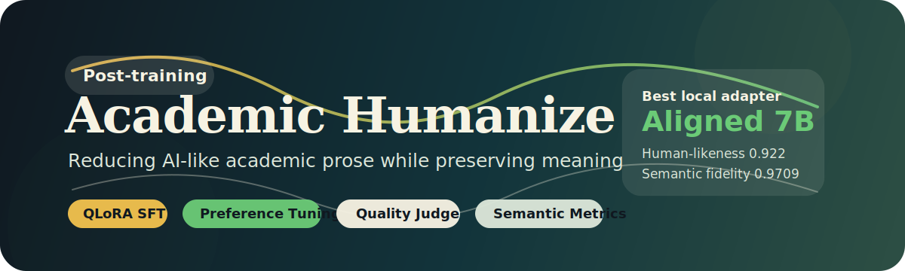
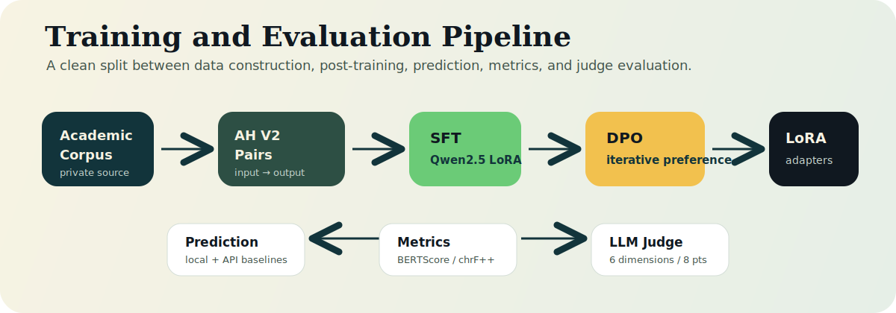
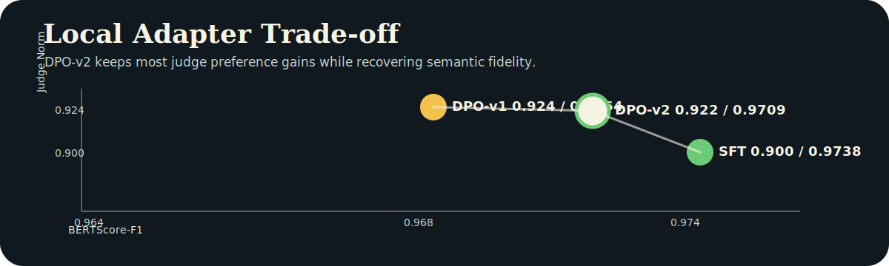

<p align="center">
  
</p>

<p align="center">
  <a href="README.en.md">English</a> · <a href="#核心技术路线">核心技术路线</a> · <a href="#实验结果">实验结果</a> · <a href="#快速开始">快速开始</a> · <a href="#复现流程">复现流程</a>
</p>

<p align="center">
  
  
  
  
  
</p>

# Academic Humanize

Academic Humanize 是一个面向学术英文改写的后训练项目，核心目标是把“去 AI 味”这件事做成一套可训练、可优化、可评测的工程闭环。

它不是一个简单的 prompt 润色脚本，而是一套完整流程：从学术语料构造 AI-like draft，到 QLoRA SFT，再到 SPIN-style DPO 和迭代 DPO，最后用自动语义指标与 LLM-as-Judge 同时评估语义保真和自然度。

```text
输入：带有 AI 味、模板感、过度正式表达的学术段落
输出：更自然、更像真人学者写作的学术英文
硬约束：不改变原意，不丢数字、引用、术语、结论和逻辑关系
```

<p align="center">
  
</p>

## 为什么做这个项目

很多通用大模型可以把英文改得更流畅，但它们经常带来三个问题：

- 表达更像 AI：使用 `pivotal`、`underscore`、`not only...but also...` 等高频模板。
- 语义不稳定：为了“更高级”而改动事实、强弱关系、数字、引用或术语。
- 难以量化：传统 BLEU/chrF/BERTScore 只能看和 reference 的接近程度，不能直接判断“像不像真人学者写的”。

本项目关注的不是泛泛的 grammar correction，而是更窄、更难的任务：在保持学术语义安全的前提下，减少 AI 写作痕迹。

## 你可以从这个项目获得什么

- 一套可复现的学术文本 humanization 后训练流程。
- 一个从 SFT 到 DPO 再到迭代 DPO 的轻量 RLHF / preference optimization 示例。
- 一个可直接复用的评测框架：自动指标负责语义保真，LLM-as-Judge 负责自然度、术语、编辑价值等主观质量。
- 一组 API baseline 对比结果，用于判断本地 7B LoRA 和闭源模型的差距。
- 可迁移的数据构造思路：只要你有“AI-like input”和“human reference”，就可以迁移到其他学术写作场景。

## 核心技术路线

本项目的关键技术含量在于把“去 AI 味”拆成四个可操作模块。

### 1. AH V2 数据构造

训练样本不是简单的“原文 -> 润色文”。每条样本都包含：

```text
input  = 带有 AI 味的学术 draft
output = 人写或高质量 reference 学术表达
```

这样模型学到的不是普通翻译或语法纠错，而是如何从模板化、过度润色、AI-like 的表达回到更自然的学术英文。

### 2. QLoRA SFT

SFT 阶段使用 Qwen2.5-7B-Instruct 作为基座，通过 QLoRA 训练低成本 LoRA adapter。

```text
instruction + input -> output
```

这一阶段主要让模型掌握任务格式、保留术语和引用，并学习基础的 humanization 风格。

### 3. SPIN-style DPO

DPO-v1 不额外依赖人工偏好标注，而是用当前 SFT 模型自己生成 rejected response：

```text
prompt   = instruction + input
chosen   = human / high-quality reference
rejected = SFT model prediction
```

逻辑是：如果人写 reference 比当前模型输出更好，就让模型继续学习两者之间的偏好差异。这相当于用模型自己的输出构造 on-policy 负样本，成本低，适合小项目快速迭代。

### 4. 迭代 DPO

DPO-v2 继续使用 DPO-v1 的输出作为 rejected，并使用更保守的学习率和 beta：

```text
prompt   = instruction + input
chosen   = human / high-quality reference
rejected = DPO-v1 model prediction
```

这样 rejected 会更接近当前模型能力边界，学习信号比第一轮更细。实验结果显示，DPO-v2 在保留 judge 偏好收益的同时，恢复了更多语义指标。

## 评测框架

本项目没有只看一个分数，而是把评测拆成两层。

### 自动语义指标

| 指标 | 作用 | 定位 |
|---|---|---|
| BERTScore-F1 | 衡量 prediction 和 reference 的语义接近程度 | 主指标 |
| chrF++ | 对术语、拼写和字符级保留敏感 | 辅助指标 |
| BLEU | 传统 n-gram overlap | 参考 |
| TER | 编辑距离类指标 | 参考 |
| Format Violation | 检查空输出、异常格式和明显失败输出 | 质量控制 |

### LLM-as-Judge

Judge 使用固定 prompt 和固定六维 rubric，输出 0 到 8 的总分。

| 维度 | 分值 | 含义 |
|---|---:|---|
| lexical markers | 0-1 | 是否避免 AI 高频词和模板短语 |
| structural patterns | 0-1 | 是否避免公式化 AI 句式 |
| naturalness | 0-2 | 是否像自然的学术英文 |
| semantic faithfulness | 0-2 | 是否保留原意、数据和逻辑 |
| terminology accuracy | 0-1 | 术语是否保留且使用准确 |
| edit value | 0-1 | 是否相比输入有实质改进 |

## 实验结果

验证集包含 346 条 Academic Humanize 段落。Judge 模型为 `deepseek-v4-flash`，prompt 使用 `evaluation/judge/prompts_fast.md`。

<p align="center">
  
</p>

### 自动指标

| Model | BERTScore-F1 | chrF++ | BLEU | TER | Format Violation |
|---|---:|---:|---:|---:|---:|
| SFT LoRA | 0.9738 | 84.72 | 72.01 | 24.93 | 0.023 |
| DPO-v1 | 0.9664 | 78.26 | 63.95 | 31.73 | 0.023 |
| DPO-v2 | 0.9709 | 81.89 | 68.95 | 27.73 | 0.023 |
| GPT-4o-mini | 0.9426 | 65.84 | 34.92 | 64.35 | 0.020 |
| Qwen2.5-7B-Instruct API | 0.8438 | 36.37 | 6.96 | 441.07 | 0.029 |
| Kimi-K2-Instruct | 0.8870 | 38.87 | 12.91 | 91.75 | 0.026 |
| DeepSeek-v4-flash | 0.9400 | 65.72 | 37.94 | 61.63 | 0.055 |
| Gemini 3.1 Flash Lite | 0.8294 | 52.28 | 13.07 | 172.10 | 1.000 |

### LLM-as-Judge

| Model | Judge Norm | Total | Lexical | Structure | Naturalness | Semantic | Terminology | Edit Value |
|---|---:|---:|---:|---:|---:|---:|---:|---:|
| SFT LoRA | 0.9003 | 7.202 | 0.908 | 0.905 | 1.725 | 1.731 | 0.994 | 0.939 |
| DPO-v1 | 0.9241 | 7.393 | 0.994 | 0.986 | 1.827 | 1.633 | 0.988 | 0.965 |
| DPO-v2 | 0.9223 | 7.379 | 0.977 | 0.968 | 1.795 | 1.691 | 0.991 | 0.957 |
| GPT-4o-mini | 0.7056 | 5.645 | 0.610 | 0.488 | 1.301 | 1.627 | 0.962 | 0.656 |
| Qwen2.5-7B-Instruct API | 0.2738 | 2.191 | 0.214 | 0.220 | 0.494 | 0.659 | 0.396 | 0.208 |
| Kimi-K2-Instruct | 0.9722 | 7.777 | 0.997 | 0.991 | 1.945 | 1.870 | 0.983 | 0.991 |
| DeepSeek-v4-flash | 0.7764 | 6.211 | 0.642 | 0.627 | 1.491 | 1.682 | 0.991 | 0.777 |
| Gemini 3.1 Flash Lite | 0.8233 | 6.587 | 0.801 | 0.786 | 1.616 | 1.572 | 0.931 | 0.882 |

### 主要结论

- SFT LoRA 在自动语义指标上最接近 reference，说明它最稳地保留了原始语义。
- DPO-v1 明显提高 LLM-as-Judge 偏好分数，但会牺牲一部分 reference 接近度。
- DPO-v2 恢复了大部分语义指标，同时保留了 DPO 的偏好收益，是当前本地 7B adapter 里的最佳折中版本。
- Kimi-K2-Instruct 的 judge 分数很高，但它是 API baseline；本项目的重点是复现一套可训练、可迭代的本地后训练流程。

## 适合谁

- 想了解 SFT、DPO、SPIN-style self-play alignment 的实践流程。
- 想复现一个小成本、可解释的 LLM 后训练项目。
- 想做学术写作、论文润色、AI text humanization 方向的实验。
- 想把 LLM-as-Judge 和传统 NLP 指标结合起来做评测。

## 项目结构

```text
academic-humanize/
├── SFT/                         # QLoRA SFT training
├── DPO/                         # DPO training from SFT or DPO adapter
├── configs/                     # SFT, DPO, eval configs
├── evaluation/
│   ├── predict/                 # local/API prediction
│   ├── metrics/                 # BLEU, chrF++, TER, BERTScore
│   ├── judge/                   # LLM-as-Judge
│   ├── leaderboard/             # report merging
│   └── detector/                # optional detector sidecar
├── scripts/dpo/                 # DPO pair construction tools
├── data/examples/               # toy examples only
└── assets/                      # README figures
```

真实论文语料、完整训练数据、预测结果、judge 结果、checkpoint 和模型权重不随仓库发布。仓库只保留 toy examples 和可复现代码。

## 快速开始

本地 API 推理和 judge 评测：

```bash
python -m venv .venv
source .venv/bin/activate
pip install -r requirements.txt
cp .env.example .env
```

AutoDL / CUDA 训练环境：

```bash
pip install -r requirements_autodl.txt
```

## 数据

仓库只包含 toy examples：

```text
data/examples/sample_train.json
data/examples/sample_val.json
data/examples/sample_dpo_pairs.jsonl
```

toy smoke test：

```bash
mkdir -p cloud_data/ah_v2/train cloud_data/ah_v2/val
cp data/examples/sample_train.json cloud_data/ah_v2/train/final_train_v2.json
cp data/examples/sample_val.json cloud_data/ah_v2/val/final_val_v2.json
```

## 复现流程

### SFT

```bash
python SFT/train.py --config configs/ah_sft_v2.yaml
```

### 本地模型推理

```bash
HF_HUB_OFFLINE=1 TRANSFORMERS_OFFLINE=1 python evaluation/predict/predict_local_model.py \
  --val-file cloud_data/ah_v2/val/final_val_v2.json \
  --model-path Qwen/Qwen2.5-7B-Instruct \
  --adapter-path checkpoints/ah_sft_v2/YOUR_SFT_ADAPTER \
  --max-new-tokens 1024 \
  --output results/predictions/ah_sft_val_pred.json
```

### API baseline 推理

```bash
python evaluation/predict/predict_api.py \
  --val-file cloud_data/ah_v2/val/final_val_v2.json \
  --api-model openai/gpt-4o-mini \
  --max-tokens 1600 \
  --max-concurrency 4 \
  --output results/predictions/ah_api_gpt4o_mini_pred.json \
  --resume \
  --save-every 20
```

### 计算 metrics

```bash
python evaluation/metrics/compute_metrics.py \
  --report-file results/predictions/ah_sft_val_pred.json \
  --output results/scored/ah_sft_val_scored.json
```

### LLM-as-Judge

```bash
python evaluation/judge/llm_judge.py \
  --report-file results/predictions/ah_sft_val_pred.json \
  --api-model deepseek-v4-flash \
  --prompt-file evaluation/judge/prompts_fast.md \
  --max-samples 0 \
  --max-concurrency 4 \
  --max-tokens 1200 \
  --output results/judge/ah_judge_sft_deepseek_v4_flash.json \
  --resume \
  --save-every 20
```

如果少量行解析失败，使用同一个 `--output` 和 `--resume` 重新运行即可；脚本会复用已解析行，只补失败行。

### 构造 DPO pair

先在 train split 上生成预测：

```bash
python evaluation/predict/predict_local_model.py \
  --val-file cloud_data/ah_v2/train/final_train_v2.json \
  --model-path Qwen/Qwen2.5-7B-Instruct \
  --adapter-path checkpoints/ah_sft_v2/YOUR_SFT_ADAPTER \
  --max-new-tokens 1024 \
  --output results/predictions/ah_sft_train_pred_for_dpo.json
```

然后构造 SPIN-style pairs：

```bash
python scripts/dpo/build_dpo_pairs_from_predictions.py \
  --train-file cloud_data/ah_v2/train/final_train_v2.json \
  --prediction-report results/predictions/ah_sft_train_pred_for_dpo.json \
  --output-all cloud_data/ah_v2/dpo/ah_dpo_pairs_all.jsonl \
  --output-train cloud_data/ah_v2/dpo/train/ah_dpo_pairs_train.jsonl \
  --output-val cloud_data/ah_v2/dpo/val/ah_dpo_pairs_val.jsonl \
  --report-file cloud_data/ah_v2/dpo/ah_dpo_pairs_report.json
```

### DPO

设置 `configs/ah_dpo.yaml` 里的 `model.sft_adapter_path`，然后运行：

```bash
python DPO/train_dpo.py --config configs/ah_dpo.yaml
```

迭代 DPO 则先生成 DPO-v1 train predictions，构造 `cloud_data/ah_v2/dpo_iter2/`，设置 `configs/ah_dpo_iter2.yaml`，然后运行：

```bash
python DPO/train_dpo.py --config configs/ah_dpo_iter2.yaml
```

## 参与和反馈

欢迎通过 GitHub Issues 提交问题、建议或复现实验结果。如果你基于自己的数据集运行了这套流程，也欢迎分享你的设置和评测结果。

联系邮箱：2812156857@qq.com
